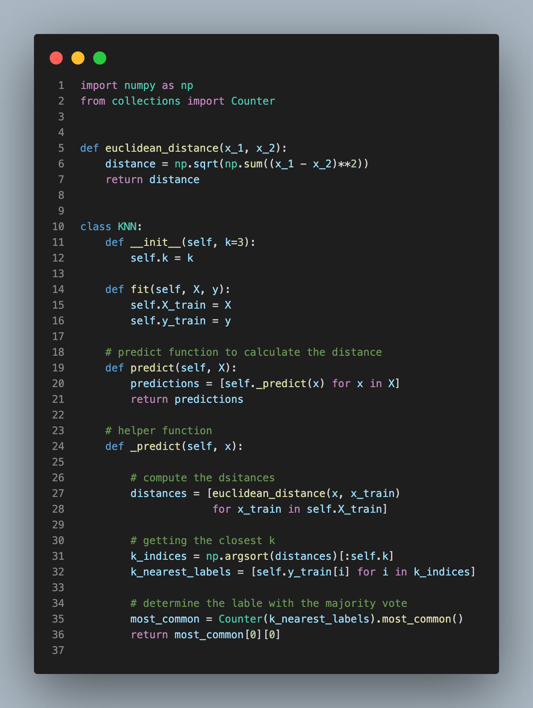
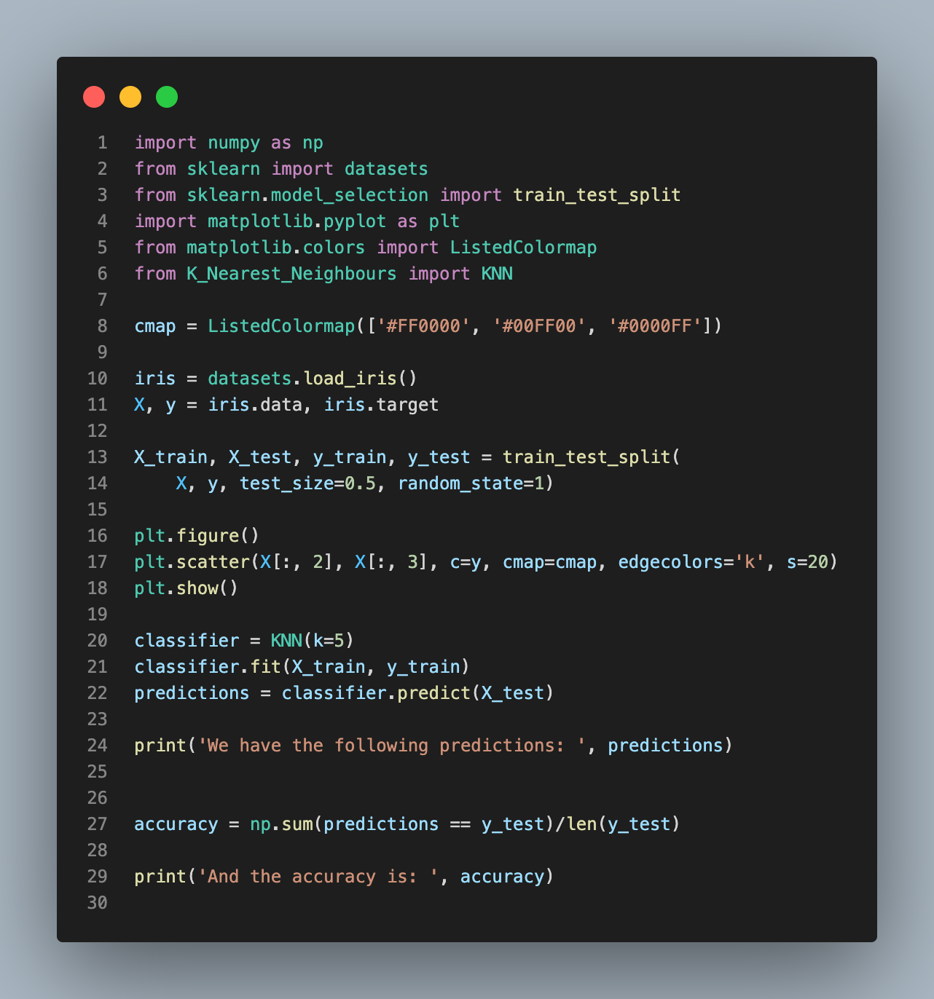

# Machine Learning Models

This repository contains some machine learning learning models created using python from scratch.

## 1. [K Nearest Neighbours (KNN)](./K_Nearest_Neighbours/)

Given a data point `x`, we calculate it's distance from all data points in the dataset. Getting the closest k points where in **Regression**: Getting the average of their values while in **Classification**: Getting the label with the majority votes.

The images below show the [K_Nearest_Neighbour.py](./K_Nearest_Neighbours/K_Nearest_Neighbours.py) and [train.py](./K_Nearest_Neighbours/train.py) files:

  
  

---

## 2. [Linear Regression](./Linear_Regression/)

**Linear Regression** is used to predict the value of a variable based on the value of other variables. The variable being predicted is called the **Dependent Variable** while the variable(s) we are using to predict it are the **Independent variable**.

### Estimation (Assumption)

Given a line equation where $\hat{y}$:

$$\hat{y} = wx + b$$

Where: $x$ is the feature, $w$ is the slope and $b$ is the bias. We can find the values of $w$ and $b$ by defining a **Cost Function**.

### Cost function (Error)

The cost function of the linear regression is simply the **Mean Square Error (MSE)** which is given by:

$$MSE = j(w,b) = \frac{1}{N} \sum_{i=1}^{n} \left( y_i - (wx_i + b)\right)^2$$

Where: $y_i$ = actual value (training samples), $(wx_i + b)$ is the estimated value, $N$ = Number of all the samples.

This error has to be as minimum as possible hence we need to find the derivative which is given by:

$$
J'(m,b) =
\begin{bmatrix}
  \frac{df}{dw} \\
  \frac{df}{db}
\end{bmatrix}
=
\begin{bmatrix}
  \frac{1}{N} \sum -2x_i \left( y_i - (wx_i + b)\right)\\
  \frac{1}{N} \sum -2 \left( y_i - (wx_i + b)\right)
\end{bmatrix} $$

### Gradient Descent

To solve the above we use an algorithm called **Gradient descent**. Which is an iterative method to get to the minimum.

$$w = w - \alpha \cdot dw$$
$$b = b - \alpha \cdot db$$

where $\alpha$ is a constant learning rate.

Thus we have the following after differentiating

$$
 dw = \frac{dJ}{dw} = \frac{1}{N} \sum_{i=1}^{n} -2x_i\left(y_i - (wx_i + b)\right) = \frac{1}{N} \sum_{i=1}^{n} 2x_i\left(\hat{y} - y_i\right)
$$
$$
db = \frac{dJ}{db} = \frac{1}{N} \sum_{i=1}^{n} -2\left( y_i - (wx_i + b)\right) = \frac{1}{N} \sum_{i=1}^{n} 2\left(\hat{y} - y_i\right)
$$

To understand the concepts further discussed here, I highly recommend reading [Linear Regression Simulator](https://sushantpatrikar.github.io/linear_reg.html).
